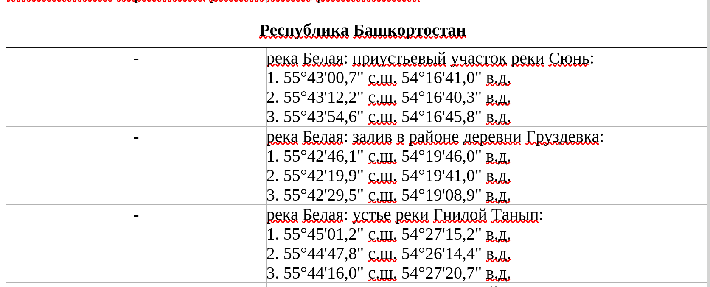

## Координаты нерестовых участков

### Проблематика

Есть Приказ Министерства сельского хозяйства РФ от 13 октября 2022 г. N 695 "Об утверждении правил рыболовства для Волжско-Каспийского рыбохозяйственного бассейна" (с изменениями и дополнениями)
где помимо всего в приложении №2: https://ivo.garant.ru/#/document/405832583/paragraph/3270:0 указаны нерестовые участки. Но указаны они в виде текстовой таблицы. 
И пользоваться этими данными не очень удобно. 

Собственно статья из которой узнал о этой проблеме: https://dzen.ru/a/aZU3tX6Ro1z6AMMd

Поэтому задача обработать эти данные и получить их в удобном формате.


### Решение

Сайт garant.ru позволяет выгрузить документ в формате odt файла. 

Пример такого файла, выгруженного с сайта: [full-list.odt](./examples/full-list.odt). 
Следует заметить, что это оригинальный файл. Скачанный и сохраненный как есть. Без каких-либо правок.

И поэтому очевидным решение является написание скрипта, который будет считывать файл odt и формировать на основе данных файл формата geoJSON.

### Формат координат

Координаты, в документе, указаны в формате ГСК 2011 (?) в виде **гг°мм'сc.ссс"** 
Т.е. целое число градусов, целое число минут и целое, либо десятичное(через запятую) число секунд.
А нужно получить координаты в формате WGS 84. Т.е. число с плавающей точкой.
 
### Ошибки в исходном документе

В результате работы часть неточностей и ошибок в задании координат получилось обойти. 
Но некоторые проще оказалось отредактировать в документе.

Следующие ошибки:

* Рыбинское водохранилище
````
2. 58°10'53,4" с.в. 38°19'16,6" в.д.
```` 
Опечатка при указании широты -  *с.в.*

* река Ока: Дзержинский пляж площадью 53,6 га:
````
6. 56°13'42" с.ш. 492 43°28'50,412" в.д.
```` 
Похоже что опечатка и секунды из широты попали в долготу

Исправленый файл можно найти здесь: [full-list-fixed.odt](./examples/full-list-fixed.odt). 
Парсинг этого файла выдает 7901 точку.
  
### Технические моменты

Самым простым способом (так как нужен только текст) оказалось работать с **ODT** файлом как с **ZIP** архивом.
Все содержмое хранится в файле content.xml  А этот файл уже довольно просто парсится как обычный *XML*

Интересующие данные лехат в файле приложения в таблицах примерно следующей структуры:

1. В строке таблицы внутри внутри заголовка находится название региона. 
2. А дальше в строках указано название районов и список точек с координатами, которые определяют этот район.

Примерно в таком виде



В ходе парсинга документа скрипт определяет регион, а потом для него сохраняет районы с координатами.

В ходе работы выяснилась одна неприятность. 
Координаты в документе в большинстве своем (~98%) указаны по одному шаблону. 
Но часть выбивается из этого шаблона. Где-то секунды указаны немного по другому. Где-то нет пробелов. 
Где-то нет точке после "ш.". И тому подобные мелочи. Чтению человеком это не мешает. 
Но вот простые регулярные выражения с этим уже не справляются. 
А редактировать документ и приводить к единому виду порядка 200 координат я посчитал лишней работой.

Поэтому пришлось отказаться от парсинга координат с помощью регулярок. 
И разбирать их с помощью обычных строковых функций. Это дало лучший вариант.


